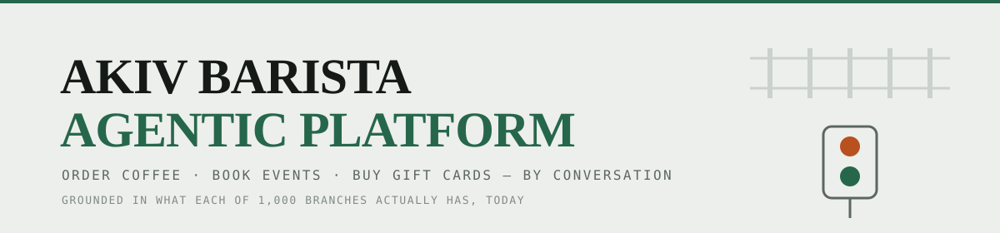
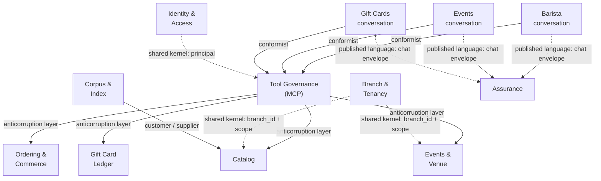

<picture>
  <source media="(prefers-color-scheme: dark)" srcset="Docs/site/assets/akiv-banner-dark.svg">
  <source media="(prefers-color-scheme: light)" srcset="Docs/site/assets/akiv-banner-light.svg">
  
</picture>

<p align="center">
  <b>Customers order coffee, book private events and buy gift cards by conversation —<br>
  grounded in what each of 1,000 branches actually has, today.</b>
</p>

<p align="center">
  
  
  
  
  
  
  
</p>

> [!TIP]
> **The full architecture plan is a designed document, not a Markdown file.**
> GitHub strips CSS from READMEs, so the version with the left index rail, the layered system diagram
> and the light/dark palette lives at **[`Docs/site/index.html`](Docs/site/index.html)** — open it locally,
> or publish it with GitHub Pages and link it here.

---

## Contents

| | Section | What's in it |
|---|---|---|
| **01** | [What this is](#what-this-is) | The shop, the three surfaces, the real menu |
| **02** | [Business architecture](#business-architecture) | Services, capabilities, value streams, context map |
| **03** | [Architecture](#architecture) | The two planes and the one rule between them |
| **04** | [The three agents](#the-three-agents) | Why ADK, why LangGraph, why LangChain |
| **05** | [The MCP tool layer](#the-mcp-tool-layer) | One tool definition, three frameworks |
| **06** | [Configuration seams](#configuration-seams) | Provider, store and identity — all per-service |
| **07** | [Branches and the order model](#branches-and-the-order-model) | 1,000 branches, one menu, a real commerce document |
| **08** | [The $1 budget](#the-1-budget) | Every default chosen for $0 standing cost |
| **09** | [Repository layout](#repository-layout) | Where everything lives |
| **10** | [Quick start](#quick-start) | `docker-all-up.sh` and what it does |
| **11** | [Cloud provisioning](#cloud-provisioning) | Numbered, manually-triggered GitHub Actions |
| **12** | [How we build](#how-we-build-backlog--openspec) | The backlog, and the OpenSpec pipeline |

---

## What this is

A platform for **AKIV Coffee** — a coffee chain of 1,000 branches across the United States.
The seeded reference branch supplies the menu, hours and event rates the fixtures are built from. Three separate agentic conversations:

| Surface | What a customer does | Grounded in |
|---|---|---|
| **Barista** | Orders coffee and pastries | The live catalog — AKIV House Blend (cocoa, toasted almond, dried cherry; Colombia + Honduras), Honeycomb, Coconut Mocha, Earl Grey Fog, Strawberry Honey Matcha, Butter Bars, local kombucha |
| **Events** | Books the room for a private event | Weeknights and Sundays only; $300 / 2h weeknight, $400 / 2h or $500 / 3h Sunday, plus 1h setup and 30min cleanup |
| **Gift cards** | Buys, reloads, checks balance | $5 / $10 / $20 / $50 / custom, individual or pooled group card, delivered by SMS or email, now or scheduled |

Three chat windows, no cross-talk between them, each with its own memory and its own failure modes.

---

## Business architecture

Scope is the agentic platform: the services it exposes, the capabilities it holds, the value streams it
delivers, and its domain boundaries. Retail operations — roasting, supply chain, staffing and store
management — sit outside this boundary and are treated as existing business functions.

### The four views, and how they relate

The section presents the platform four times, from four angles. They are not alternative descriptions of the
same list — each answers a different question, and something that appears in one usually appears in the
others in a different form.

The first three come from business architecture. The fourth, the context map, comes from domain-driven
design. Mixing traditions is deliberate: the first three describe what the business does, and the context map
is where that starts constraining how the software is divided.

| | Answers | Form | How often it changes | Example here |
|---|---|---|---|---|
| **Business capability** | What are we *able* to do? | A noun phrase. No sequence, no consumer, no technology | Rarely. Survives reorganisation and rewrites | *Grounding & Truth Assurance* |
| **Business service** | What do we *offer*, to whom, under what contract? | A named consumer plus a published contract | When the offer or its contract changes | *Grounded Conversation*, offered to customers over the chat envelope |
| **Value stream** | How does a stakeholder *get* value, from trigger to outcome? | An ordered set of stages, each adding value | When the journey changes, not when the technology does | *Conversation → Fulfilled order* |
| **Context map** | Where does one model end and another begin, and who owns each? | Named boundaries plus a typed relationship on every edge | When ownership or integration changes | *Conversation → Tool Governance → Catalog* |

**One example through all four.** The ability to ensure every claim traces to a source is a **capability** —
it would still be named that if the platform were rebuilt in a different language on a different cloud.
Packaged and exposed to customers, that capability becomes the **Grounded Conversation service**, with the
SSE chat envelope as its contract. "Ground in reality" is a **stage** in the *Conversation → Fulfilled order*
value stream, where the stream draws on that capability to move the customer forward. And on the **context
map** that one capability turns out to span three boundaries — the conversation context asks, Tool Governance
translates, Catalog answers — which is the map's job: to say which boundary owns which part, and what the
contract is at each seam.

A capability is frequently realised across several bounded contexts, as here. That is normal, and it is the
reason both views are needed: the capability says the ability exists, the context map says who holds which
piece of it.

**Which comes first** depends on whether you are modelling or discovering.

- *Modelled* order is capabilities first. They are the most stable layer, so services and value streams can
  be re-cut against them without the model being rebuilt. A capability model outlives the org chart.
- *Discovered* order is usually value streams first, because a real project starts from "how does a customer
  actually get what they came for" and derives the capabilities from the stages that turn out to be needed.
- *This document* runs services, then capabilities, then value streams, then the context map — reading order,
  not modelling order. Services come first because they are the most concrete: they have a named consumer and
  a contract, so they are the easiest thing to disagree with.

**The context map comes last of the four, and that is not arbitrary.** A boundary cannot be placed until you
know what abilities exist, what is offered to whom, and how value moves between them — so it consumes the
other three as input. It is also the last artefact on the business side and the first that constrains code:
everything before it could be implemented many ways, and the context map begins ruling some of them out.
That is why it sits immediately before the technical architecture in this document rather than anywhere else.

**A test for telling them apart**, when something is hard to classify:

- If it would survive a reorganisation and a full rewrite, it is a **capability**.
- If it has a consumer and a published contract, it is a **service**.
- If it has a trigger, ordered stages and an end state, it is a **value stream**.
- If it names a boundary and states who conforms to whom, it belongs on the **context map**.

Four distinctions worth keeping straight: a capability is not a process, because it has no sequence; a
service is not an API, though it is usually reached through one; a value stream is not a process flow, since
its stages are units of value to a stakeholder rather than tasks in a workflow; and a context map is not a
deployment or component diagram — its boundaries are around *models and their language*, not around
processes or servers. Two services can run in one process and still be separate contexts, and one context can
be spread across several services.


### Business services

Each service has a named consumer and a published contract, and can be consumed independently of the others.

| Business service | Consumer | Published contract | Value it carries |
|---|---|---|---|
| **Grounded Conversation** | Customers, on three surfaces | SSE chat envelope | Answers that trace to a system of record; a refusal where no source exists |
| **Tool Catalog** | Agents, and any external MCP client | MCP tool schemas, versioned | A single definition of each capability, consumable by any framework |
| **Authority** | Every service and agent | Internal principal | A single identity shape across four providers, with scope enforced at the API |
| **Deterministic Commerce** | Portals, agents, order pipeline | Priced order document | A single authoritative price for a given cart, branch and date |
| **Human Decision** | Branch and regional staff | Durable decision events | Staff decisions recorded durably and consumable asynchronously |
| **Model Portability** | Operators | Provider config + conformance certificate | Provider changes are configuration changes, within a certified set |
| **Agent Assurance** | Engineering and product | Traces, evals, cost ledger | Measurable behaviour, so regressions surface in CI |

#### What these names mean

**Grounded Conversation** — *grounded* is a property of each claim, not of the conversation's style. A claim
is grounded when it traces to a retrieval or tool result produced in the same turn from a system of record.

- Grounded, and therefore assertable: whether an item exists; whether it is available at a given branch on a
  given date; its allergens and available milks; its price; an order total; a card balance; a slot's
  availability; an event rate.
- Not grounded, and therefore not assertable: anything no system records — preparation method,
  cross-contamination risk, what is popular, whether staff recommend something, availability next week. The
  response states that it is not known and, where relevant, directs the customer to staff.
- Enforced by a response check comparing claims against that turn's tool results. A response containing an
  unsupported claim is blocked and regenerated, rather than discouraged by prompt wording.

**Tool Catalog** — the name is taken from the implementation and does read as technical. In business terms it
is the governed register of actions the platform permits an automated agent to take: each action has an
owner, a version, a stated contract, and a read-or-write classification that determines which agents may hold
it at all. *Agent Action Governance* would describe the same service without naming the mechanism, if a
business-facing label is preferred.

**Authority** — the right to perform a specific action on a specific branch's data. Distinct from
authentication, which establishes identity only.

- Whose authority: the human in the conversation, customer or staff. An agent holds none of its own and
  carries no service account, so automation is not a route to permissions no person has.
- Why it is separate: authority is checked at the domain API, independently of which tools an agent was
  given. Capability answers *was this action available to the agent*; authority answers *may this person take
  it, at this branch*. Both are checked; both must pass.
- What it governs: branch scope, staff role, realm separation between staff and customer, and the price
  policy bands that determine whether an override applies immediately or escalates for approval.

**Deterministic Commerce** — *deterministic* means the same inputs produce the same output every time, from a
single implementation, with no model involved in the calculation.

- Deterministic: unit price resolution including any override effective on that date; modifier deltas; line
  subtotals; discount application in stored sequence; tax resolution against a versioned rate table; all
  stored totals; idempotent submission.
- Not deterministic, by design: which items an agent proposes, how it describes an order, and when it asks a
  clarifying question. Those are judgements and are the model's work.
- The boundary between the two defines the service: a model decides what to propose; it never computes what
  that costs.
- Determinism also holds over time. Because totals and the tax `rate_version` are stored rather than derived
  on read, an order priced two years ago reprices identically today.

**Human Decision** — a staff judgement recorded as a durable event rather than delivered as a callback, so it
survives the agent being unavailable and can be consumed whenever the conversation resumes.

**Model Portability** — the name is technical for the same reason *Tool Catalog* is: *model* names the
component rather than the concern. The business concern is **supplier independence** — the ability to change
AI supplier without re-engineering the applications that depend on one. *Supplier Independence* would be the
business-facing label.

- What it covers: chat provider and embedding provider are separately switchable per service, so a change of
  cloud or of commercial terms is a configuration change.
- What bounds it: portability applies only within the set of providers that has passed tool-calling
  conformance. An uncertified provider is not available for use, so this is not a claim that any model will
  work — it is a claim about a known, tested set.
- Why it is a business service rather than an implementation detail: it determines whether a supplier's
  pricing change, deprecation notice or regional availability is a procurement decision or a project.

**Agent Assurance** — assurance that responses are *correct*, as distinct from assurance that the system
*ran*. Conventional monitoring answers the second question and cannot answer the first.

An agent can execute without fault — no errors, normal latency, every dependency healthy — and still
recommend an item the branch does not stock, or state a balance that does not exist. The response is
well-formed and returns 200. Nothing in latency, error-rate or throughput monitoring detects it.

Four properties of an agent create that gap, and each is what a part of this service exists to cover:

| Property | Consequence | What assurance adds |
|---|---|---|
| Non-deterministic output | One passing run is not evidence of correctness | Repeated behavioural evaluation reporting a rate, not a pass |
| Correctness is semantic | The defect sits in the content of a valid response | Evals asserting which items were named and whether figures trace to a tool result |
| Behaviour changes with no code change | A supplier updates a model and output shifts while version control shows nothing | Provider conformance certification and re-certification on drift |
| Cost varies per request | Spend is a function of conversation shape, not request count | Cost accounting per turn, surface and provider |

Part of this service is ordinary observability that any system needs — request lineage across services, and
cost accounting. Remove the agents and that part remains. What would not remain, and what has no equivalent
in a deterministic system, is the evaluation and attribution layer: behavioural evals in CI, guardrail block
rates as a leading signal of grounding regression, and knowing which prompt version, model and toolset
produced a specific turn.

Without it, a grounding regression is reported by a customer rather than caught by a build.


### Business capabilities

Stable abilities, independent of how they are implemented. Level 1 in bold, level 2 beneath.

| Capability | What it means here |
|---|---|
| **Conversational Engagement** | Intent capture · surface isolation · session continuity · contextual entry from any screen |
| **Grounding & Truth Assurance** | Retrieval grounding · provenance enforcement · honest refusal · monetary provenance |
| **Tool Governance** | Define-once tool specification · read/write capability partitioning · schema conformance · tool discovery and versioning |
| **Authority & Scope Enforcement** | Principal propagation · branch scope · realm separation · policy bands and approval trails |
| **Deterministic Commerce** | Pricing authority · multi-jurisdiction tax resolution · order document integrity · idempotent transaction |
| **Human-in-the-Loop Orchestration** | Workflow checkpointing · interrupt and resume · staff decisioning · durable handoff across downtime |
| **Model & Vendor Portability** | Provider abstraction · conformance certification · embedding-space stewardship · cost governance |
| **Agent Assurance** | Trace lineage · behavioural evaluation · cost accounting · prompt and configuration versioning |

> [!NOTE]
> **Grounding & Truth Assurance** and **Tool Governance** carry constraints the other capabilities depend on.
> Grounding requires that every factual and monetary claim trace to a tool result in the same turn, enforced
> by a response check rather than by prompt instruction. Tool Governance requires that a capability be
> specified once and consumed unchanged by all three frameworks. Relaxing either changes the guarantees
> available to every capability above it.

#### In plain terms

**Grounding.** The assistant may not tell a customer anything it did not look up while writing that reply.
If someone asks whether a drink is dairy-free, it has to fetch that item and read its allergen list. It
cannot answer from general knowledge about lattes, and it cannot reuse an answer from earlier in the same
conversation — a price or a card balance may have changed since. A separate check reads the finished reply
before it is sent and blocks it if it contains a fact or a figure that did not come back from a lookup.
Telling a model to "only use the menu" is an instruction it can fail to follow; blocking the reply is not.

**Tool Governance.** "Look up the menu" is written down once, with one set of inputs and outputs, and all
three assistants use that same definition. If it were written three times — once for each assistant — then a
change such as adding a dietary filter would have to be made in three places. The first time one was missed,
two assistants would give different answers to the same question. Writing it once removes that possibility
instead of relying on everyone remembering.

**Why these two come first.** Everything else here — taking an order, quoting an event, issuing a gift card —
assumes the answers are true and that the three assistants behave the same way as each other. These two are
limits on what the system is allowed to do, rather than things it does. Weaken either one and the features
built on top stop being guaranteed and start depending on the model behaving well on the day.


### Value streams

Each stream is end-to-end and ends in value to a named stakeholder. Three are customer-facing; the last two
are internal to platform operation.

**Conversation → Fulfilled order** *(customer)*
```
Establish context → Understand need → Ground in reality → Compose & price → Confirm → Commit → Fulfil & track
```
Enabled by: Conversational Engagement · Grounding · Deterministic Commerce · Authority

**Inquiry → Confirmed booking** *(customer + branch staff)*
```
Establish context → Qualify requirements → Check real availability → Quote → Hold
    → ⏸ escalate for human decision → Resume → Confirm or decline
```
Enabled by: Human-in-the-Loop Orchestration · Grounding · Authority
The escalation stage is a defined state rather than an error path: the stream crosses from automated
handling to a human decision and resumes from checkpointed state afterwards, potentially days later.

**Intent → Delivered gift** *(purchaser + recipient)*
```
Establish context → Choose value → Confirm → Issue & capture → Schedule → Deliver → Redeem at any branch
```
Enabled by: Deterministic Commerce · Grounding (monetary provenance) · Authority

**Capability → Governed tool** *(platform engineering)*
```
Identify capability → Define once → Classify read or write → Certify schema → Publish
    → Attach to agents → Observe → Version
```
Enabled by: Tool Governance · Agent Assurance
Without this stream, a capability such as `search_menu` is implemented separately in each framework and the
implementations diverge.

**Candidate model → Certified provider** *(operators)*
```
Nominate candidate → Run conformance suite → Compare against threshold → Certify or reject
    → Configure per service → Monitor drift → Re-certify
```
Enabled by: Model & Vendor Portability · Agent Assurance
A provider that has not completed this stream is unsupported, and services refuse to start when configured
with it.

### Context map

Bounded contexts and the relationship patterns between them. The pattern on each edge is the contract — it
says who conforms to whom, and where translation happens.



| Pattern | Where it applies | What it means |
|---|---|---|
| **Conformist** | Conversation contexts → Tool Governance | Agents accept published tool schemas as given rather than defining their own, so one definition serves ADK, LangGraph and LangChain |
| **Anticorruption layer** | Tool Governance → domain contexts | MCP translates domain APIs into agent-facing tools. Domain models are not exposed to a prompt, and model-shaped concerns are not introduced into a domain |
| **Open host / published language** | Domain contexts upstream | Each domain publishes an HTTP contract and a shared error envelope, consumed identically by MCP, the portals and any future client |
| **Shared kernel** | Identity and Tenancy → everything | The internal principal and `branch_id` are small, jointly-owned models. Changing either is a coordinated change, by design |
| **Customer / supplier** | Corpus & Index → Catalog | The indexer is upstream and serves a downstream consumer whose query needs drive it |

> [!IMPORTANT]
> **Three boundaries that must never be merged**, each for a different reason:
>
> 1. **The three conversation contexts share no model.** Separate sessions, separate memory, separate failure
>    modes. Merging them allows context established in one domain to affect responses in another.
> 2. **Tool Governance does not reach past a domain API into storage.** An MCP server holding a database
>    connection constitutes a second data plane, outside the constraints the domain API enforces.
> 3. **The gift card ledger is not partitioned by branch.** Branch is an attribute of a movement. Partitioning
>    it means a card bought at one branch is not redeemable at another.


---

## Architecture

Two planes, and one rule that holds the whole design together:

> [!IMPORTANT]
> **Agent services never open a database connection.**
> An agent's tool is an HTTP or MCP call, never a query. `CATALOG_STORE` is read by exactly one process —
> `catalog-api`. Break this and you implement the Postgres-or-JSON switch four times and it drifts three ways.

```
  Angular portals          Barista chat  ·  Events chat  ·  Gift card chat
         │                 SSE: token · tool_call · ui_action · done
         ▼
  gateway (BFF)            auth · session id · trace id · rate limit
         │
         ▼
  agent plane              barista-agent      events-agent       giftcards-agent
                           Google ADK         LangGraph          LangChain
         │                 ── tools resolved through the MCP layer ──
         ▼
  MCP servers              catalog-mcp        events-mcp         giftcards-mcp
         │                 one tool definition, consumed by all three frameworks
         ▼
  data plane               catalog-api        events-api         giftcards-api
         │                 ═══ repository seam: <DOMAIN>_STORE ═══
         ▼
  storage                  Postgres + pgvector  ·  Redis  ·  JSON shard corpus
                                  ▲                                  │
                                  └──── indexer: shards → rows ──────┘
```

Full diagram, with labelled edges and the reasoning behind each layer, in
**[`Docs/site/index.html`](Docs/site/index.html)**.

---

## The three agents

The frameworks are not interchangeable decoration — each domain has a different control-flow shape.

| | **Barista** | **Private events** | **Gift cards** |
|---|---|---|---|
| **Framework** | Google ADK | LangGraph | LangChain |
| **Shape** | Tool-calling loop over a large catalog | Stateful workflow with validation gates | Bounded tool-calling chain |
| **Why** | Breadth of retrieval, no required order of operations | The **interrupt** is the point — a half-finished booking must survive a refresh *and* a staff decision | The least framework that does the job |
| **State** | Session → Redis | Checkpointer → Postgres | Session → Redis |

> [!NOTE]
> **Money and availability are never generated.**
> The gift card agent may not state a balance that did not come back from a tool call this turn.
> A 2-hour Sunday event at 7pm occupies the room 6:00pm–9:30pm once setup and cleanup are counted —
> that arithmetic lives in `events-api`, not in a prompt.

---

## The MCP tool layer

Each domain publishes **one MCP server**, and all three agent frameworks consume it.

Without this, the same `search_menu` capability gets written three times — once as an ADK function tool,
once as a LangChain `@tool`, once again for LangGraph — and the three definitions drift. With it, the tool
is defined once, versioned once, and tested once.

| MCP server | Tools | Consumed by |
|---|---|---|
| `catalog-mcp` | `search_menu` · `get_item` · `price_order` | barista-agent, Claude Code, admin console |
| `events-mcp` | `find_slots` · `quote` · `hold_slot` · `submit_inquiry` | events-agent |
| `giftcards-mcp` | `list_denominations` · `quote_card` · `issue_card` · `reload_card` · `check_balance` | giftcards-agent |
| `ops-mcp` | `index_status` · `reindex_shards` · `shard_stats` · `resolve_interrupt` | the team, from Claude Code |

**How each framework attaches:** ADK via its MCP toolset; LangChain and LangGraph via
`langchain-mcp-adapters`. Transport is stdio locally and streamable HTTP when deployed.

> [!WARNING]
> **Read and write tools live on separate MCP servers.**
> `issue_card` and `submit_order` are not on the same server as `search_menu`. An agent that only needs
> to read is given only the read server, so it *physically cannot* call a write tool — a boundary the
> prompt cannot be talked out of.

An MCP server is a façade over the domain API's HTTP endpoints — **not** over the database. The two-plane
rule above still holds; MCP sits inside the agent plane, not underneath it.

---

## Configuration seams

Two switches, each read in exactly one place, each settable per service.

**Seam one — LLM provider, per service:**

```dotenv
# Middleware/barista-agent/.env
BARISTA_LLM_PROVIDER=ollama                          # the $0 default
BARISTA_LLM_MODEL=qwen2.5:7b
BARISTA_LLM_BASE_URL=http://ollama:11434

# the embedding provider is a SEPARATE switch from the chat provider
CATALOG_EMBED_PROVIDER=ollama
CATALOG_EMBED_MODEL=nomic-embed-text                 # 768 dims, self-hosted

# Middleware/events-agent/.env
EVENTS_LLM_PROVIDER=gemini
EVENTS_LLM_MODEL=gemini-2.5-flash

# Middleware/giftcards-agent/.env
GIFTCARDS_LLM_PROVIDER=azure_openai
GIFTCARDS_LLM_MODEL=gpt-4o-mini
```

| Provider | LangChain / LangGraph | Google ADK | Embedding dims |
|---|---|---|---|
| `gemini` | native | native | 768 |
| `bedrock` | native | via LiteLLM | 1024 |
| `azure_openai` | native | via LiteLLM | 1536 |
| `huggingface` | native | via LiteLLM, patchy | 384 |
| `ollama` | native | via LiteLLM | 768 (nomic-embed-text) |

> [!TIP]
> **Chat provider and embedding provider are configured independently on purpose.** The chat provider can
> follow the cloud you deployed to; the embedding provider should not, because changing it invalidates every
> vector you own. Self-hosting the embedder — Ollama locally or in your own cloud — makes the vector space a
> constant you control, so an AWS deployment and a GCP deployment can differ on chat while sharing one index.
> Ollama is also the standing fallback if ADK's LiteLLM path proves unreliable for tool calling.

> [!CAUTION]
> **Embedding dimensions are not portable.** 768 / 1024 / 1536 / 384 are different vector spaces.
> Key the embedding table on `(provider, model, dim)` and never mix them in one index. Changing the
> catalog's embedding provider means re-embedding the corpus — a batch job with a progress table,
> not a Friday config change.

**Seam two — data store, per service:**

```dotenv
CATALOG_STORE=hybrid        # postgres | json | hybrid
EVENTS_STORE=json           # event definitions from files…
EVENTS_BOOKING_PG_DSN=…     # …bookings always Postgres
```

| Mode | Reads | Writes | Search |
|---|---|---|---|
| `json` | Shard file + LRU | Read-mostly, append journal | SQLite FTS5 sidecar |
| `postgres` | Indexed rows | Transactional | pgvector + trigram |
| `hybrid` | Postgres (hot) | Files authoritative, reconciled by indexer | pgvector |

> [!IMPORTANT]
> **Reference data is pluggable. Transactional data is Postgres, always.**
> Menu items and event templates can live in files. Orders, bookings, holds and the gift card ledger
> cannot — they need atomicity and an audit trail no directory of JSON files will give you.

**Seam three — identity, per deployment:**

```dotenv
AUTH_PROVIDER=basic          # basic | cognito | entra_id | gcp_identity
AUTH_PG_DSN=postgresql://akiv@postgres:5432/authz
```

`authz-api` is the only service that knows which identity provider is in play. Whichever it is, it emits
**one internal principal shape** — so swapping `basic` for Cognito is a deployment decision, not a code change.

```
principal = { sub, email, realm: staff | customer,
              roles:        [ hq | regional | branch_manager | staff ] | [ customer | guest ],
              branch_scope: [ "*" ] | [ "br-0042", … ] }
```

**Two realms, one service.** Staff and customers authenticate against separate API surfaces —
`/v1/staff/*` and `/v1/customer/*` — with distinct user tables, token audiences and provider settings,
sharing one principal shape and one verification path:

```dotenv
AUTH_STAFF_PROVIDER=cognito        # staff via the corporate pool
AUTH_CUSTOMER_PROVIDER=basic       # customers in our own Postgres
```

Customer accounts unlock saved favourites, order history and a **gift card wallet** — which is what makes a
global ledger useful to the person holding the card. **Guest ordering stays first-class**: nobody creates an
account to buy a coffee, and a guest who registers mid-flow carries their cart, sessions and in-flight order
across to the new account.

| Value | Where identity lives | `authz-api`'s job |
|---|---|---|
| `basic` | Postgres `auth_users`, argon2id | Authenticate and **issue** the token |
| `cognito` | AWS Cognito user pool | **Verify** the JWT and map claims |
| `entra_id` | Microsoft Entra ID | Verify and map claims |
| `gcp_identity` | GCP Identity Platform | Verify and map claims |

> [!WARNING]
> **Local auth is real auth.** `AUTH_PROVIDER=basic` means a seeded user table, argon2id hashing and genuine
> token issuance — *not* a header-injected fake user. If local identity is fake, every authorization bug
> you have ships, because nothing in the development loop ever exercised the check.

Agents hold no service account: an agent carries the caller's principal through to every MCP tool call.
Combined with the read/write server split, an agent given only the read server **and** a customer principal
is doubly unable to issue a gift card — capability and authority are separate checks and both must pass.

---

## Branches and the order model

**1,000 branches, and the three domains do not scale the same way across them.**

| Domain | Varies by branch? | What actually differs |
|---|---|---|
| **Menu** | No — brand-wide and identical | Only availability, the daily rotation, and occasional regional price override |
| **Events** | Yes, substantially | Branch size tier sets capacity, hostable event types, staffing cost — and therefore the rate card |
| **Gift cards** | No, and must not | A card bought at one branch redeems at any other. Branch is an attribute of a transaction, never a partition of the balance |

```
catalog_items        ~50 rows    brand-wide, canonical, embedded exactly once
branch_metrics       branch_id · seats · sqft · staff_headcount      # observed facts
branch_tier          tier_id · min_seats · max_seats · max_event_guests · staffing_cost_index
event_rate_card      tier_id · day_type · duration_hours · price · setup_minutes · cleanup_minutes
branch_profile       1,000 rows  tier_id · tier_assigned_by (auto|manual) · jurisdiction_id · region
branch_availability  (branch_id, item_id, effective_date) -> available, price_override, rotation
price_policy         scope · category · role_required · max_delta_pct · requires_approval_above_pct
price_override_request  proposed_price · reason · requested_by · status · approved_by
```

**Tiering is data, not an enum.** Seats is the primary driver (event capacity is literally seats), square
footage breaks ties, and `staffing_cost_index` modifies price rather than capacity. A nightly job assigns
tiers from metrics; a branch can be pinned manually *with a recorded reason*, and the job leaves it alone.
Start with four tiers and let the table prove that number. The reference branch seeds the mid tier as real
`event_rate_card` rows — not constants in code.

**Price authority is a policy table with an approval trail.** A regional manager proposes an override; inside
their band it applies immediately, above it escalates to HQ as `pending`. Either way there is a row with a
reason, an actor and a timestamp — so "why is a latte $6.25 in Raleigh" has an answer.

> [!IMPORTANT]
> **Semantic search runs once, brand-wide. Availability filtering runs per branch, relationally.**
> `search_menu(query, branch_id)` searches the ~50 canonical items by vector, then filters against that
> branch's availability. Never embed per branch — the vectors would be a thousand identical copies of the
> same fifty. This is why the embedding bill is cents rather than tens of gigabytes.
>
> What genuinely needs indexing at scale is *availability*: 1,000 branches × ~50 items × 365 days is ~18M
> rows a year. That is a b-tree on `(branch_id, effective_date)`, not a vector problem.

`branch_id` is a **required** parameter on nearly every MCP tool. A tool called without one fails loudly
rather than defaulting to a flagship — a barista answering from the flagship's availability while the customer
stands in Raleigh is worse than one that asks which store.

**An order is a commerce document, not a list of drinks:**

```
order_header          order_id · branch_id · customer_ref · channel (web|chat|pos)
                      subtotal · discount_total · tax_total · shipping_total · grand_total
order_line            line_no · item_id · item_snapshot · qty · unit_price · line_total
order_line_modifier   modifier_id · snapshot · price_delta
order_discount        code · scope · type (pct|amount) · value · sequence · applied_amount
order_tax             scope · jurisdiction · rate · taxable_base · tax_amount
order_shipping        method · address_ref · cost · tax_amount        # retail only
order_payment         method (giftcard|card|mock) · amount · ref · status
order_event           append-only status transitions, with actor
```

Four rules this structure exists to enforce: **lines snapshot the item** (an order must not change when HQ
edits a price); **discounts are ordered and their result is stored** (10% then $2 off ≠ $2 off then 10%);
**taxes are many and per jurisdiction**; **totals are stored, never derived on read**.

Tax rates come from a **versioned rate table** — Postgres or JSON, per the same store seam — loaded into an
in-process cache at pod start. No external tax service, no network hop on the ordering path.

```
tax_jurisdiction   jurisdiction_id · name · state · county · city
tax_rate           jurisdiction_id · category (prepared|grocery|merchandise)
                   rate · effective_from · effective_to · rate_version
```

| Reference jurisdiction — seed data | Prepared drink | Whole bean / merchandise |
|---|---|---|
| NC state | 4.75% | 4.75% |
| County + transit | 2.50% | 2.50% |
| Prepared food & beverage | 1.00% | — |
| **Combined** | **8.25%** | **7.25%** |

Those figures are **illustrative seed data, not tax advice** — verify every jurisdiction before real money
moves. Three rules the cache obeys: orders store the resolved rate *and* its `rate_version`; **a pod that
cannot load rates fails readiness** rather than quietly computing zero tax; and invalidation is explicit —
pods poll `rate_version` and reload, so every pod converges without a restart.

Fulfilment goes through a `PosAdapter` whose methods mirror a real point-of-sale. `MockPosAdapter` moves a
ticket through accepted → in progress → ready → collected on a timer — same decision as payments: real
contract, no real integration.

---

## The $1 budget

**Target: $0 standing cost, no more than $1 for a full cloud provision–demo–destroy cycle.** These are
*defaults*, not constraints — the seams are exactly what make a free default safe, because switching provider
is a variable rather than a project.

| Concern | The call | Why | Cost |
|---|---|---|---|
| Chat model | `ollama · qwen2.5:7b` | Self-hosted locally and in cloud from one image. Gemini free tier is the fallback | $0 |
| Embeddings | `ollama · nomic-embed-text` | 768 dims, self-hosted — pins the vector space so it never needs re-embedding | $0 |
| Postgres | Neon free tier | pgvector included, scales to zero, one DSN works from laptop *and* all three clouds | $0 |
| Redis | Upstash free tier | Or omit it — Redis is a performance choice here, not a correctness one | $0 |
| Registry | `ghcr.io` | One registry all three clouds pull from; removes a numbered block per cloud | $0 |
| Primary cloud | GCP Cloud Run | Scales to zero with a monthly free grant; Azure Container Apps is the equivalent second target | ~$0 |
| AWS | Demo-only: provision → demo → destroy | Nothing on AWS scales to zero cheaply | <$1/cycle |
| Kubernetes | Not in the budget | A managed control plane costs more per month than this entire target | — |
| Shard corpus | Full 300k local, sampled in cloud | 300k object writes is a real charge and proves nothing a 100-file sample doesn't | $0 |
| Identity | `basic` | Cognito/Entra free tiers are also $0, but `basic` is portable and is what local dev exercises | $0 |
| Tracing | OTel + Jaeger in compose | Native free-tier tracing when deployed | $0 |

> [!NOTE]
> **This is exactly why AWS got CloudFormation.** Under this posture the numbered Destroy workflows are
> routine, not emergency equipment — the stack goes up for a demo and comes down the same afternoon.
> Export-enforced teardown ordering is what makes a same-day destroy safe to run without reading the console.
>
> **On dropping Kubernetes:** the tax rate-cache design is unchanged — it caches per *instance* rather than
> per pod, still fails readiness when rates won't load, and still converges on a `rate_version` poll. Cloud
> Run and Container Apps both honour a readiness signal. Run `kind`/`k3d` locally if you want the manifests.

> [!WARNING]
> **What the dollar costs you.** A 7B model on a laptop is materially weaker at tool calling — the one
> capability this whole architecture rests on. Do not assume a small local model reliably calls our tools
> with the right arguments. It is the *first* experiment, before any agent code, and if it fails the answer
> is Gemini's free tier for the barista rather than redesigning the tools.

---

## Repository layout

```
Middleware/
  shared/              installable pkg: llm providers, repositories, telemetry, config
  gateway/             BFF: token verification, session, SSE fan-out, tracing
  authz-api/           FastAPI · users, roles, branch scope, token issue/verify
  catalog-api/         FastAPI · menu, sizes, mods, allergens, retail
  events-api/          FastAPI · calendar, slot math, quotes, inquiries
  giftcards-api/       FastAPI · denominations, issuance, ledger, balance
  orders-api/          FastAPI · carts, orders, order state machine
  mcp/                 catalog-mcp · events-mcp · giftcards-mcp · ops-mcp
  barista-agent/       Google ADK
  events-agent/        LangGraph
  giftcards-agent/     LangChain
  indexer/             batch: shards → Postgres rows + embeddings

Portals/
  CoffeeShop/          Angular · customer, three chat surfaces
  CoffeeShopAdmin/     Angular · catalog, bookings, ledger, agent console

DevOps/
  Local/               docker-all-{up,down,status}.sh + per-component compose
  Cloud/
    AWS/cloudformation/  stack per numbered block, cross-stack exports
    Azure/terraform/     state per stack in Azure Storage
    GCP/terraform/       state per stack in GCS
    contracts/           the shared stack interface all three implement

Docs/
  JIRA/DevMgmt/        the product backlog — epics, features, stories
  site/                the designed architecture plan (GitHub Pages)

.github/workflows/     AWS- / AZURE- / GCP- numbered Setup + Destroy pairs
```

> [!WARNING]
> **Three agent services means three dependency sets and three containers.**
> Do not put ADK and LangChain in one virtualenv — ADK pins `google-genai` and `langchain-google-genai`
> pins it differently. `Middleware/shared` is the only code they hold in common, and it stays
> dependency-light on purpose.

---

## Quick start

```bash
git clone <this repo> && cd Agentic-Barista-Coffee-Shop
cp DevOps/Local/.env.shared.example DevOps/Local/.env.shared   # set your provider keys
./DevOps/Local/docker-all-up.sh
```

`docker-all-up.sh` is ordered and health-gated — that ordering is the whole value of the script:

```
1. network.sh                    create shared external network (idempotent)
2. Postgres + Redis              up, then WAIT for healthcheck
3. alembic upgrade head          migrations, per domain database
4. indexer --bootstrap           only if the shard corpus is newer than the index
5. domain APIs + MCP servers     wait for /healthz
6. the three agent services      wait for /healthz
7. gateway → portals
```

| Service | Port | | Service | Port |
|---|---|---|---|---|
| Postgres | 5432 | | barista-agent | 8201 |
| Redis | 6379 | | events-agent | 8202 |
| authz-api | 8100 | | giftcards-agent | 8203 |
| catalog-api | 8101 | | MCP servers | 8301–8304 |
| events-api | 8102 | | gateway | 8080 |
| giftcards-api | 8103 | | CoffeeShop portal | 4200 |
| orders-api | 8104 | | CoffeeShopAdmin portal | 4201 |

`./DevOps/Local/docker-all-status.sh` prints each service's container state, `/healthz`, **and the
provider and store it actually resolved** — with a config matrix this size, "which model is the events
agent using right now" is a question you ask several times a day.

---

## Cloud provisioning

Every workflow is `workflow_dispatch` only. Nothing provisions or destroys on a push.

```
<CLOUD>-<NNNN>-<Setup|Destroy>-<Target>.yml

AWS-0001-Setup-Network.yml        AWS-0001-Destroy-Network.yml
AWS-0100-Setup-Postgres.yml       AWS-0100-Destroy-Postgres.yml
AWS-0300-Setup-DomainApis.yml     AWS-0300-Destroy-DomainApis.yml
AWS-0310-Setup-AgentServices.yml  AWS-0310-Destroy-AgentServices.yml
AWS-0900-Setup-All.yml            AWS-0999-Destroy-All.yml
…and the same numbers under AZURE- and GCP-.
```

**The number is the dependency order.** Setup runs ascending, Destroy runs descending — so a full
teardown drops portals before gateway before agents before data, and network teardown is last by
construction. Each Destroy refuses if a higher-numbered stack still exists.

| Block | Owns | AWS | Azure | GCP |
|---|---|---|---|---|
| `0001–0099` | Network, identity, OIDC trust | VPC, IAM | VNet, RG, managed identity | VPC, WIF |
| `0100–0199` | Data plane | RDS, ElastiCache, S3 | PG Flexible, Cache, Blob | Cloud SQL, Memorystore, GCS |
| `0200–0299` | Registry and images | ECR | ACR | Artifact Registry |
| `0300–0399` | Middleware services | ECS Fargate | Container Apps | Cloud Run |
| `0400–0499` | Portals + CDN | S3 + CloudFront | Static Web Apps | Storage + LB |
| `0500–0599` | Observability | CloudWatch + OTel | App Insights | Cloud Trace |
| `0900–0999` | Composites | reusable-workflow callers chaining the blocks in order | | |

**AWS uses CloudFormation; Azure and GCP use Terraform.** One numbered block is one CloudFormation stack
or one Terraform state, so `0100-Destroy-Postgres` is a single `delete-stack` or a single scoped `destroy` —
never a hunt through a console for orphaned resources.

> [!NOTE]
> **CloudFormation enforces the teardown order for you.** Each stack publishes its outputs as exports and the
> next block up imports them, so CloudFormation refuses to delete a stack whose exports are still in use —
> `0001-Destroy-Network` simply fails while anything above it is alive. Terraform gives no such guard across
> separate states, so the Azure and GCP Destroy workflows implement that check explicitly, written once in
> the reusable workflow.

Auth is OIDC federation — no long-lived cloud keys in secrets. Every Destroy takes a typed confirmation
input that must match the environment name, and a `concurrency` group keyed on `(cloud, env, block)`
stops a Setup and a Destroy racing on the same stack.

Because the provider abstraction already exists, **the same images run on all three clouds** — AWS sets
`*_LLM_PROVIDER=bedrock`, Azure sets `azure_openai`, GCP sets `gemini`. The templates differ; the
application does not.

---

## How we build: backlog → OpenSpec

The backlog in **[`Docs/JIRA/DevMgmt/`](Docs/JIRA/DevMgmt/)** is written product-owner-first and stops at
the *what*. [OpenSpec](https://openspec.dev/) owns the *how*.

```
Docs/JIRA/DevMgmt/
  BACKLOG.md                    the ordered epic index — the single source of sequence
  000N-<Epic-Name>/
    EPIC.md                     intent, success measures, feature index
    FEAT-000N-0M-<Name>.md      one feature, containing its stories
```

Each story carries a narrative, numbered Given/When/Then acceptance criteria, an explicit **out of scope**
line, and a suggested OpenSpec change id. Then:

```bash
/opsx:explore                        # for stories marked "needs exploration"
/opsx:propose add-menu-semantic-search
/opsx:apply
/opsx:verify
/opsx:archive
```

**One story, one OpenSpec change.** Acceptance criteria are written at story granularity precisely so each
`/opsx:apply` stays inside a reviewable diff.

Build order — and it is deliberate:

1. **Portals first (0001–0004)** against contract stubs, so the API shape is settled by looking at real
   screens rather than by argument.
2. **Domain services (0005–0012)** — identity, branches, catalog, orders, events, gift cards, corpus.
3. **MCP layer and agents (0013–0017)** — one tool definition, then ADK, LangGraph, LangChain over it.
4. **Cloud workflows (0018)** — once there is something to provision.

---

## License

MIT — see [LICENSE](LICENSE).
